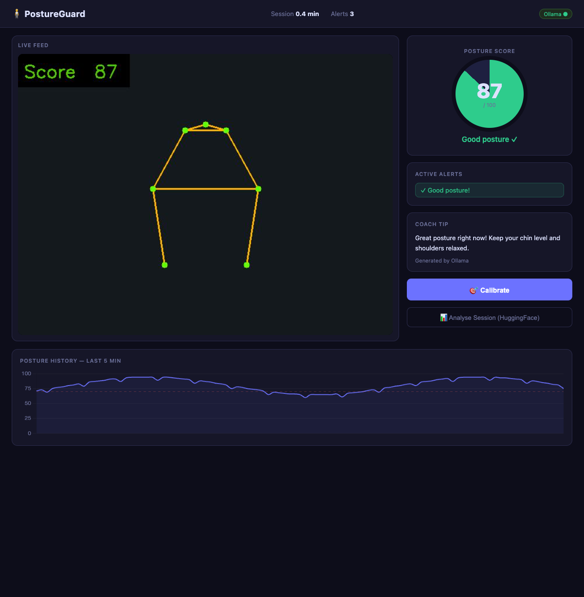
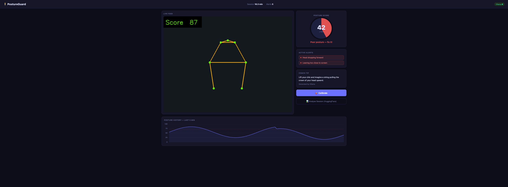

# PostureGuard 🧍

Real-time posture monitor for macOS. Sits in your menu bar, watches your camera, and nudges you before your back gives out.


---

## Install

```bash
brew tap elliotverstraelen/postureguard
brew install postureguard
postureguard
```

On first launch macOS will ask for camera access — click OK.

---

## Features

- **Menu bar app** — lives in the top bar as 🟢/🟡/🔴 + score; no dock icon
- **Personal calibration** — sit in your normal working position for 2 seconds; all thresholds are relative to *your* baseline, not fixed angles
- **4 posture signals** detected from a single front camera:
  - Head drop (nose toward shoulder line)
  - Forward lean (shoulders appear wider = you moved closer)
  - Shoulder asymmetry (one side higher than the other)
  - Head tilt (ear line not horizontal)
- **Smart notifications** — alerts after 30 s of sustained bad posture; "Good job!" when you correct yourself
- **AI coaching tips** via Ollama (optional) — personalised advice based on which signals fired
- **Phone detection** — optional alert when you've been looking down for X minutes
- **Settings window** — native frosted-glass panel to switch cameras, tune thresholds, and manage calibration data
- **Live View** — floating window showing all camera feeds side-by-side with MediaPipe skeleton overlay and real-time score
- **Multi-camera support** — use your MacBook camera, Logitech webcam, or iPhone Continuity Camera; or all at once for the best detection
- **Calibration Studio** — label your common poses as good/bad to personalise the detection model over time
- **Flask dashboard** (optional) — full web UI with live video, score gauge, history chart, and HuggingFace session analysis

---

## Screenshots

| Good posture | Poor posture alert |
|---|---|
|  |  |

---

## How it works

PostureGuard uses **MediaPipe Pose** (33 body landmarks) from the front camera. On calibration it averages 60 frames into a personal baseline. Every subsequent frame is scored by deviation from that baseline — so someone who naturally leans slightly left still gets a fair score.

When the score drops below 70/100 for 30 continuous seconds, a macOS notification fires. If **Ollama** is running locally, the tip is generated from the active alert types. Otherwise a curated static tip is used.

---

## Calibration tip

Calibrate while looking at the **screen you actually work on** — not the camera. If you use a laptop below an external monitor, look at the laptop during calibration so that position becomes your baseline "good posture".

---

## Optional: web dashboard + AI analysis

```bash
git clone https://github.com/elliotverstraelen/posture-guard
cd posture-guard
python -m venv .venv && source .venv/bin/activate
pip install -r requirements.txt        # includes Flask, HuggingFace, torch
python app.py                           # opens http://127.0.0.1:5000
```

---

## Optional: Ollama coaching tips

```bash
brew install ollama
ollama serve
ollama pull qwen3:8b
```

PostureGuard auto-detects Ollama and falls back to static tips if it's not running.

---

## Development

```bash
git clone https://github.com/elliotverstraelen/posture-guard
cd posture-guard
python -m venv .venv && source .venv/bin/activate
pip install -r requirements-menubar.txt
python menu_bar_app.py
```

**Releasing** — push a version tag and CI does the rest:

```bash
git tag v1.2.0 && git push --tags
```

GitHub Actions builds the `.app`, creates a GitHub Release with the zip, and updates the Homebrew formula SHA256 automatically.
